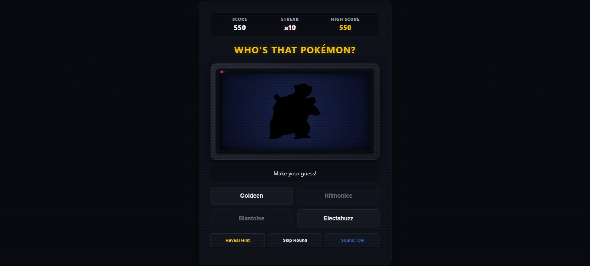

# Who's That Pokémon?

This is an old style arcade game where you have to identify the Pokémon from their silhouettes. It has all 151 of the Pokémon it keeps track of how many you get right in a row and it looks like something you would find in an old basement from 1999.



## Try It Out

You can play this game in your browser without having to set anything up.

You can do this by going to this link:

**[Play the Demo](https://anupsharma12.github.io/Whos-that-Pokemon/)**

---

## Quick Start

If you want to play the game on your computer you have to do a few things.

First you have to get the game files from the internet.

Then you have to start a program on your computer that lets you play the game.

This is important because the game will not work without it.

1. **Get the game files:**

You can do this by using the following commands in your computer:

```bash

git clone https://github.com/AnupSharma12/Whos-that-Pokemon.git

cd Whos-that-Pokemon

```

2. **Start the program:**

If you have Python on your computer you can use that.

You can start it by using the following command:

```bash

python -m http.server 8000

```

If you have Node on your computer you can use that instead.

You can start it by using the following command:

```bash

npx serve

```

3. **Play the game:**

Now you can play the game by going to this address in your browser:

`http://localhost:8000` (or the address that the program tells you to go to).

---

## Features

- ** style arcade look:** The game has a special old style look with a glass border around the screen lines going across the screen and lights that blink.

It is like playing an arcade game from the late 1990s.

The Who's That Pokémon game has this look.

- **Old style sound effects:** The game uses sound effects that are made right in your browser.

It does not need to download any files so the sound effects start right away.

The Who's That Pokémon game has these effects.

- **Pokémon data from the internet:** The game gets all the Pokémon data from a website called PokeAPI.

It gets the pictures, names and types of all 151 of the Pokémon.

The Who's That Pokémon game uses this data.

- **Keep track of your score:** The game keeps track of how Pokémon you guess correctly in a row.

This is like a score that gets bigger when you guess correctly.

The Who's That Pokémon game keeps track of your score.

- **Get a hint or skip a question:** If you are having trouble guessing a Pokémon you can get a hint about what type of Pokémon it's

You can just skip that question and go on to the next one.

The Who's That Pokémon game lets you do this.

---

## How It Works

### Old Style Sound Effects

The game does not use any files like MP3 or WAV files.

Instead it uses a program in your browser to make the sound effects.

It uses sounds like a triangle sound, a sawtooth sound and a sine sound to make the effects.

The game has three effects:

- **Click sound:** A short triangle sound that happens when you click on something.

The Who's That Pokémon game has this sound.

- **Win sound:** A special sound that happens when you guess a Pokémon correctly.

It is like a song that goes up.

The Who's That Pokémon game has this sound.

- **Lose sound:** A sound that happens when you guess a Pokémon incorrectly.

It is like a sound that goes down.

The Who's That Pokémon game has this sound.

### Pokémon Pictures

The game uses a trick to make the Pokémon pictures look like silhouettes.

It just makes the picture black and white. That makes it look like a silhouette.

When you guess a Pokémon correctly the picture. You can see the full picture.

The game does not need to use any programs to change the picture it just uses a simple trick.

The Who's That Pokémon game uses this trick.

---

## Credits

- **PokeAPI**. This is a website that has all the data about the Pokémon.

The Who's That Pokémon game uses this website to get all the Pokémon data.

- **Nintendo & Game Freak**. These are the companies that made the Pokémon games and the "Whos That Pokémon?" part of the games that this game is based on.

The Who's That Pokémon game is, like those games.
